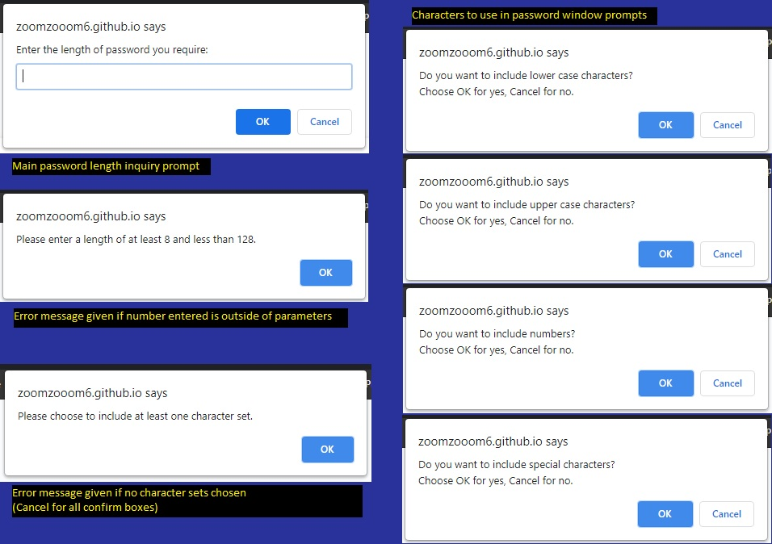

# Password Generator Starter Code
The purpose of this project is to create a webpage landing that allows a user to generate a password based on certain criteria they need for their password.

### Criteria:
* Length of password 
    * Minimum 8 chars
    * Maximum 128 chars
* Character types to include
    * Lowercase
    * Uppercase
    * Numbers
    * Special Chars
* Validate input and min one char type chosen
* Password displayed after generation as either
    * Alert
    * Written to page

## Website
https://zoomzooom6.github.io/Password_Generator/

## Contribution
Designed by Tony Huang.

## Final Results

### Main landing page

### Criteria components asked

### Output of result
